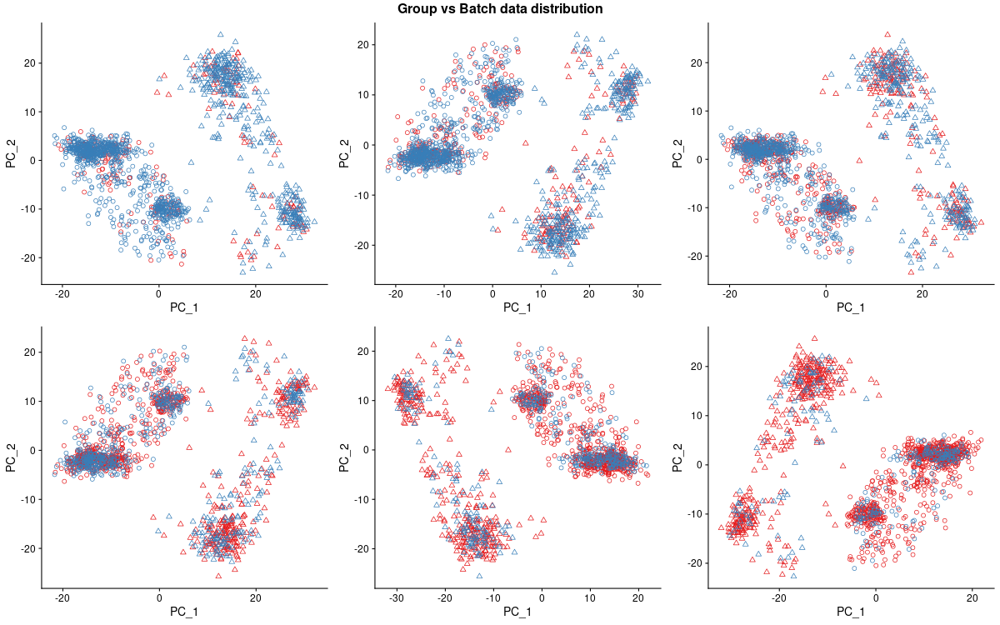
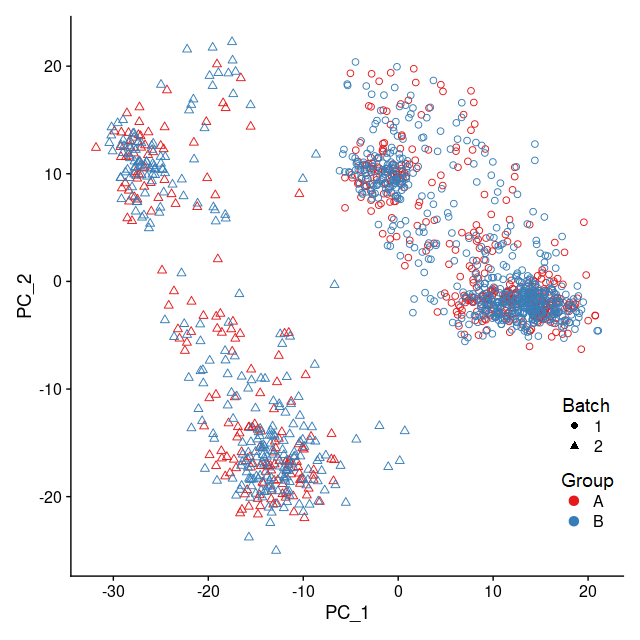
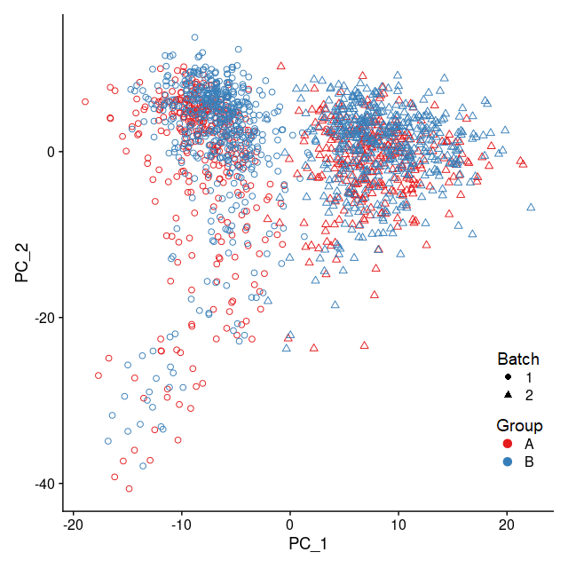
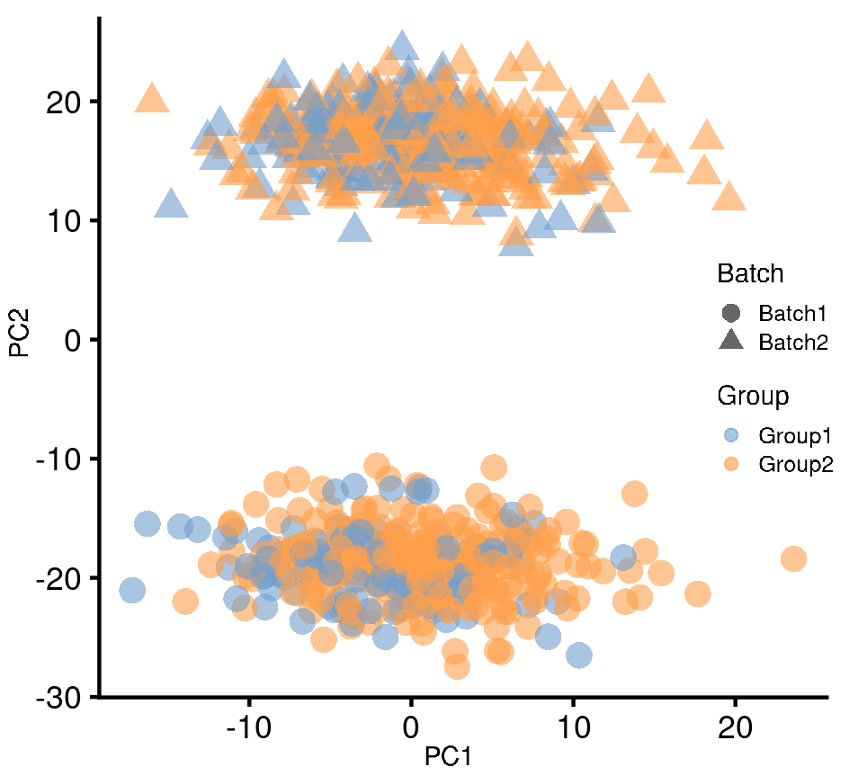
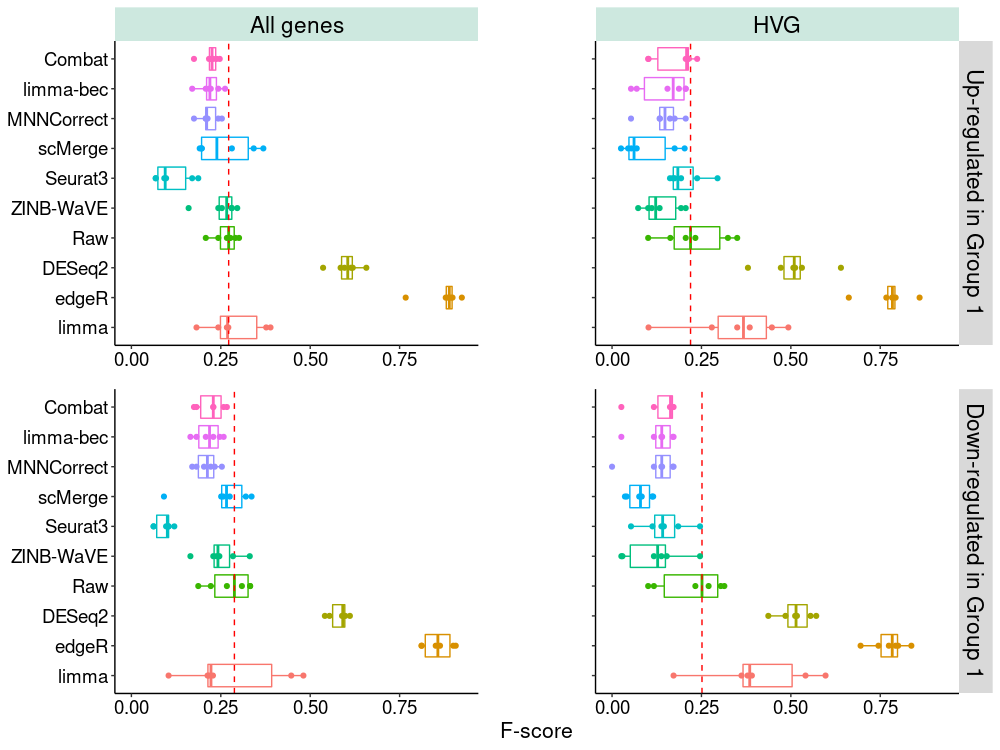
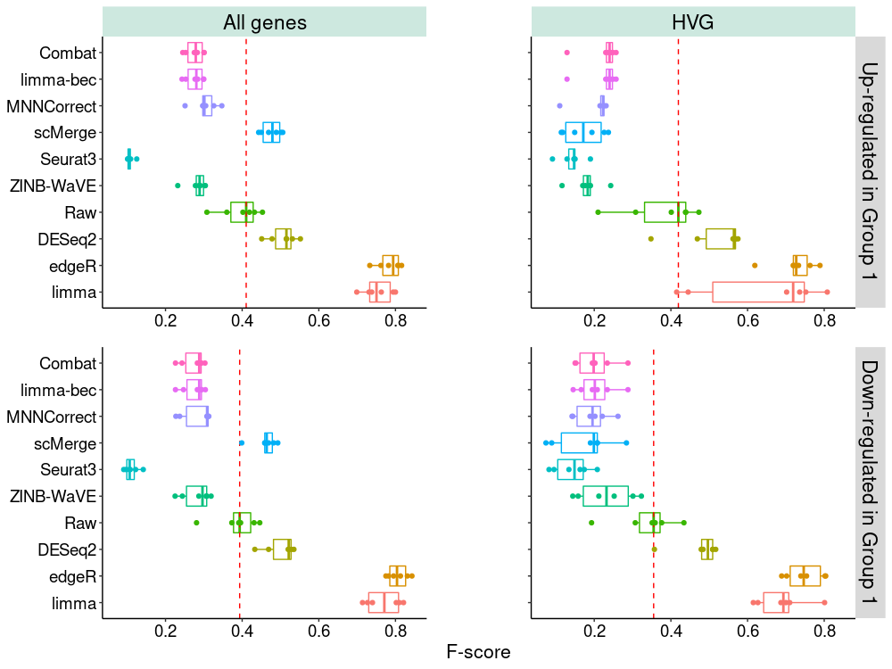
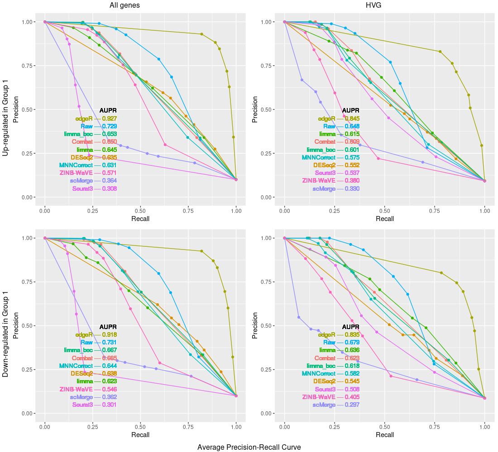
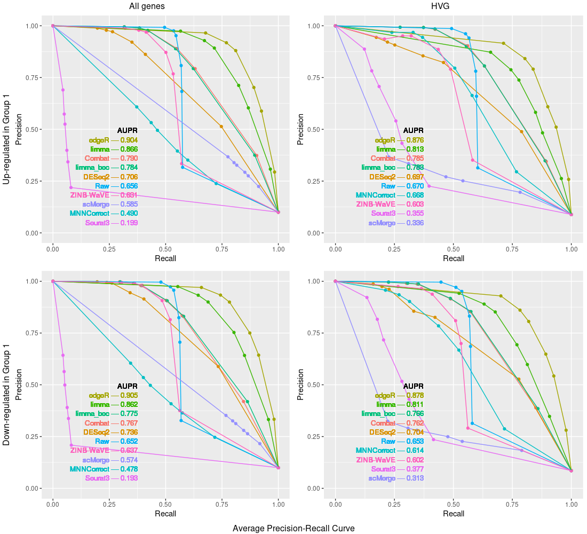

# On using batch-effect-corrected data for differential expressionanalysis of single-cell RNA sequencing data

### Group vs. Batch data distribution - Mouse Cell Atlas
 
  * We have plotted the distribution of 6 datasets we have simulated from Mouse Cell Atlas dataset. Each subplot clearly shows the large batch difference and the tiny difference between groups. Moreover, plots also show the various ratios of cells in each batch and group that we have implemented on purpose.

### Performance (F-score, Precision-recall curve) of selected methods on specific datasets
| **Mouse Cell Atlas dataset** | **Human Pancreas dataset** | **Splatter simulation dataset** |
| --- | --- | --- |
|  |  |  |
|  |  |  |
|  |  |  |

### Comparison of sparsity level distribution over cells  
 

### data 
  * Including code and the results of processing 2 real datasets: **Mouse Cell Atlas** and **Human Pancreas**

### results
  * Including code and processed data to quickly re-plot the submitted figures

### code
  * This github includes **modified and additional code** for supporting the response to the article at: https://genomebiology.biomedcentral.com/articles/10.1186/s13059-019-1850-9

  * The original code can be found at: https://github.com/JinmiaoChenLab/Batch-effect-removal-benchmarking
