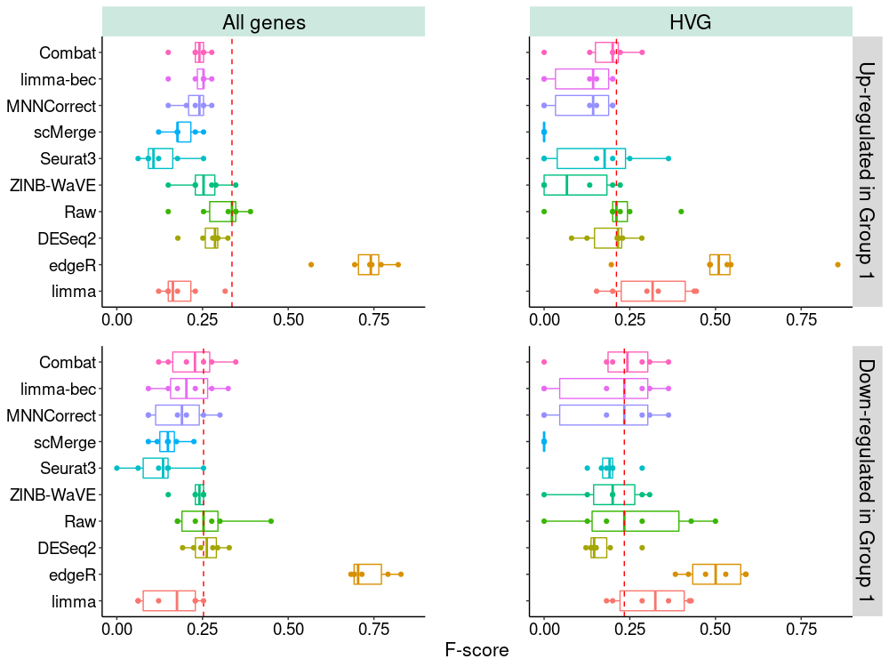
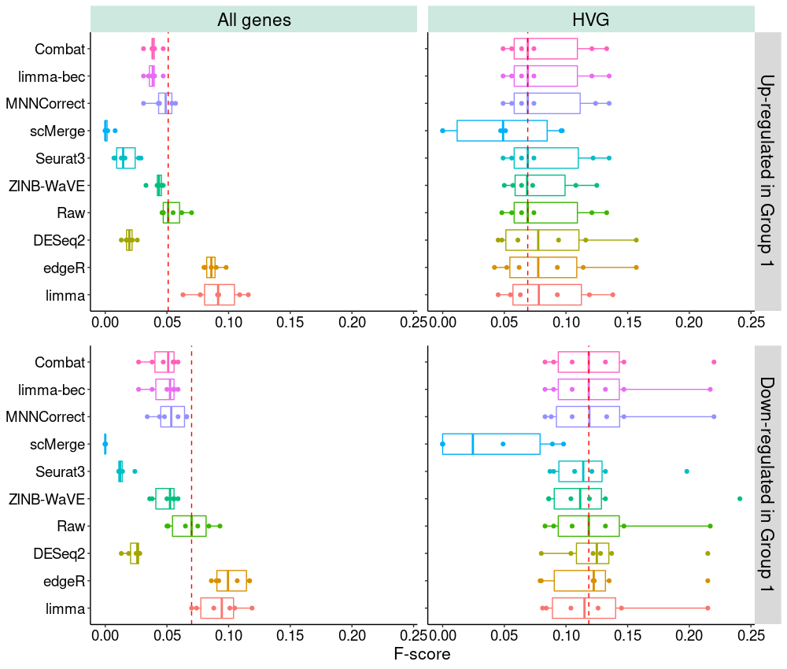

# On using batch-effect-corrected data for differential expressionanalysis of single-cell RNA sequencing data

## Mouse Cell Atlas dataset 

## Human Pancreas dataset   

## Sparsity distribution over cells  
 

#### data 
Including codes for processing 2 real datasets: **Mouse Cell Atlas** and **Human Pancreas**.

#### code
This github includes **modified and additional code** for supporting the response to the article at: https://genomebiology.biomedcentral.com/articles/10.1186/s13059-019-1850-9

The original code can be found at: https://github.com/JinmiaoChenLab/Batch-effect-removal-benchmarking
